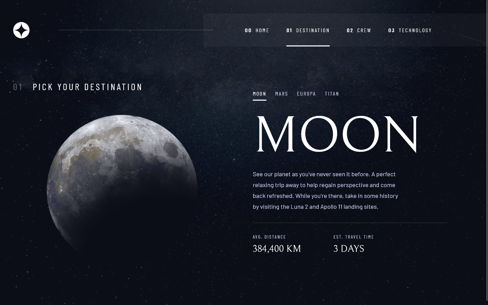

# Frontend Mentor | Space tourism multi-page website

This is a solution to the Space tourism multi-page website. The challenge is from [Front-end Mentor.](https://www.frontendmentor.io/challenges/space-tourism-multipage-website-gRWj1URZ3)

## Developing
### What I learned

- This challenge was very good, I learned a lot of things, I decided that the application would consume a json, which I created `data.json` myself, to consume it I created a custom hook `useFetch.tsx`, to avoid the request every time it is processed the component, use the `useContext` hook, so I only have to make the request once, this is equated in the `fetchContext.tsx` file.
- In the process of developing the app I had some problems with TypeScript, anyway I spent hours thinking why I was getting this error, which by the way is about `fetchContext`, it may sound silly, but both FetchContext and FetchProvider should be written in UpperCamelCase, well, I wrote it in LowerCamelCase.
- I also failed too much creating the custom hook `useFetch.tsx`, more hours, deciphering because the first time I rendered the component, the data from `data.json` was not there, I solved this with useEffect, and useContext.
- After many problems, I began to study React a little more thoroughly, I learned to use mixins, from styled-components, since it repeated a lot of code, I studied a little bit of environment variables, and finally I reviewed a bit of React Router and I'm new in this but I started to get interested in react-transition-group.

### Challenge consists of

1. View the optimal layout for each of the website's pages depending on their device's screen size.
1. See hover states for all interactive elements on the page.
1. View each page and be able to toggle between the tabs to see new information.

### Technologies used in the project

1. [React](https://es.reactjs.org/) + [TypeScript](https://www.typescriptlang.org/)
1. [styled-components](https://styled-components.com/)
1. [Vite](https://vitejs.dev/)
1. [React Router](https://reactrouter.com/en/main)
1. [react-transition-group](https://reactcommunity.org/react-transition-group/)

## Demo

🖥 If you want to see the solution, [click here]().
 
🌎 If you want to see the solution in Frontend Mentor, [click here]().

### Screenshots

## Author

- Harvey Yerik

  - [Frontend Mentor](https://www.frontendmentor.io/profile/YerikAH)
  - [Twitter](https://twitter.com/yerikhar)
  - [GitHub](https://github.com/YerikAH)
